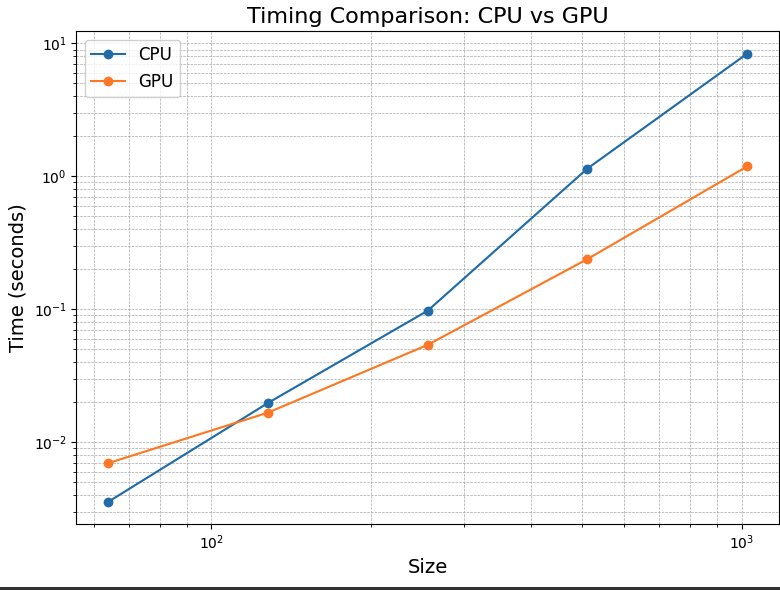
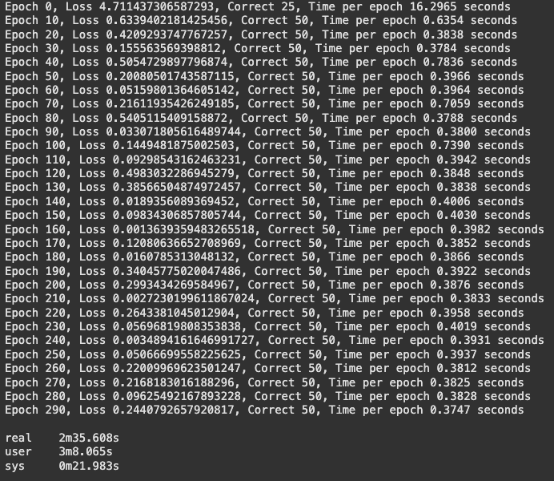
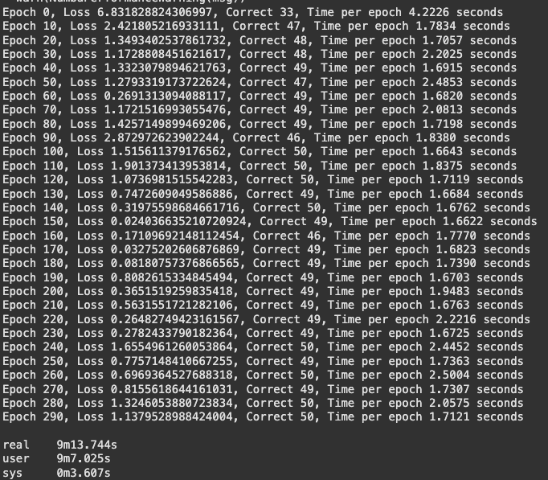
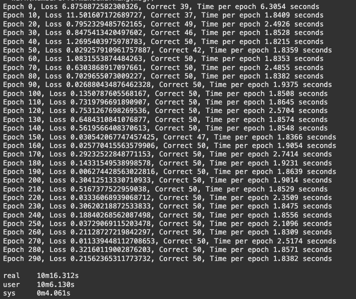
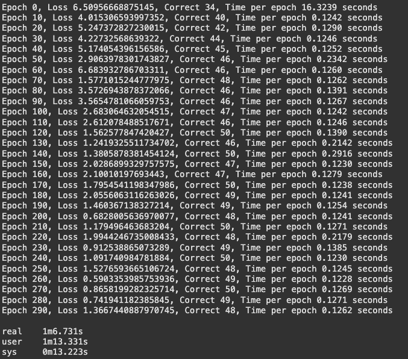
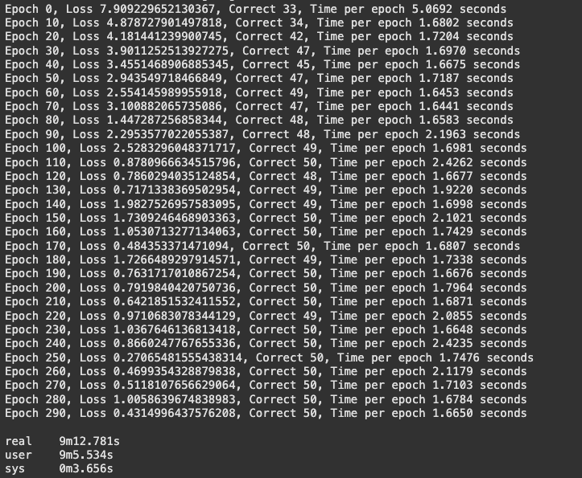
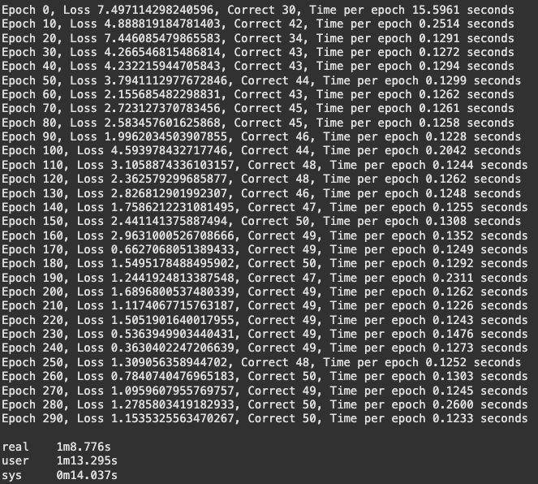
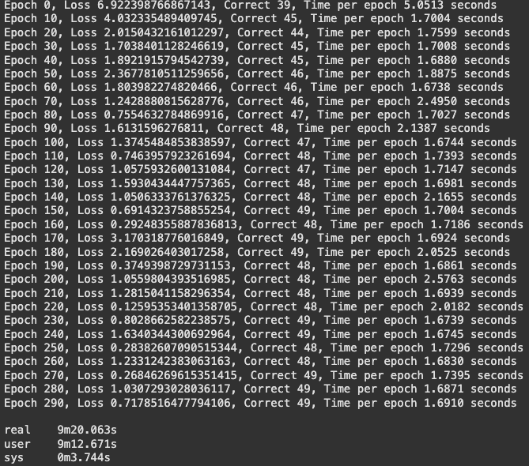

# MiniTorch Module 3


* Docs: https://minitorch.github.io/

* Overview: https://minitorch.github.io/module3.html


You will need to modify `tensor_functions.py` slightly in this assignment.

* Tests:

```
python run_tests.py
```

* Note:

Several of the tests for this assignment will only run if you are on a GPU machine and will not
run on github's test infrastructure. Please follow the instructions to setup up a colab machine
to run these tests.

This assignment requires the following files from the previous assignments. You can get these by running

```bash
python sync_previous_module.py previous-module-dir current-module-dir
```

The files that will be synced are:

        minitorch/tensor_data.py minitorch/tensor_functions.py minitorch/tensor_ops.py minitorch/operators.py minitorch/scalar.py minitorch/scalar_functions.py minitorch/module.py minitorch/autodiff.py minitorch/module.py project/run_manual.py project/run_scalar.py project/run_tensor.py minitorch/operators.py minitorch/module.py minitorch/autodiff.py minitorch/tensor.py minitorch/datasets.py minitorch/testing.py minitorch/optim.py

# Implementation Tasks

## Task 3.1 and 3.2 Results 

**Optimization Log:**
```
================================================================================
 Parallel Accelerator Optimizing:  Function tensor_map.<locals>._map, 
/Users/gracezhang/Desktop/MLE/mod3-gracezhang01/minitorch/fast_ops.py (163)  
================================================================================


Parallel loop listing for  Function tensor_map.<locals>._map, /Users/gracezhang/Desktop/MLE/mod3-gracezhang01/minitorch/fast_ops.py (163) 
--------------------------------------------------------------------------------------------|loop #ID
    def _map(                                                                               | 
        out: Storage,                                                                       | 
        out_shape: Shape,                                                                   | 
        out_strides: Strides,                                                               | 
        in_storage: Storage,                                                                | 
        in_shape: Shape,                                                                    | 
        in_strides: Strides,                                                                | 
    ) -> None:                                                                              | 
        # TODO: Implement for Task 3.1.                                                     | 
        # raise NotImplementedError("Need to implement for Task 3.1")                       | 
        # if shapes and strides are the same, we can just apply map avoid indexing          | 
        if list(out_shape) == list(in_shape) and list(out_strides) == list(in_strides):     | 
            # parallel main loop                                                            | 
            for i in prange(len(out)):------------------------------------------------------| #0
                out[i] = fn(in_storage[i])                                                  | 
        # else, we need to handle the broadcasting                                          | 
        else:                                                                               | 
            for i in prange(len(out)):------------------------------------------------------| #1
                # numpy buffers for indices                                                 | 
                in_i = np.empty(MAX_DIMS, np.int32)                                         | 
                out_i = np.empty(MAX_DIMS, np.int32)                                        | 
                to_index(i, out_shape, out_i)                                               | 
                broadcast_index(out_i, out_shape, in_shape, in_i)  # handle broadcasting    | 
                # convert back to positions                                                 | 
                in_pos = index_to_position(in_i, in_strides)                                | 
                out_pos = index_to_position(out_i, out_strides)                             | 
                out[out_pos] = fn(in_storage[in_pos])                                       | 
--------------------------------- Fusing loops ---------------------------------
Attempting fusion of parallel loops (combines loops with similar properties)...
Following the attempted fusion of parallel for-loops there are 2 parallel for-
loop(s) (originating from loops labelled: #0, #1).
--------------------------------------------------------------------------------
----------------------------- Before Optimisation ------------------------------
--------------------------------------------------------------------------------
------------------------------ After Optimisation ------------------------------
Parallel structure is already optimal.
--------------------------------------------------------------------------------
--------------------------------------------------------------------------------
 
---------------------------Loop invariant code motion---------------------------
Allocation hoisting:
The memory allocation derived from the instruction at 
/Users/gracezhang/Desktop/MLE/mod3-gracezhang01/minitorch/fast_ops.py (182) is 
hoisted out of the parallel loop labelled #1 (it will be performed before the 
loop is executed and reused inside the loop):
   Allocation:: in_i = np.empty(MAX_DIMS, np.int32)
    - numpy.empty() is used for the allocation.
The memory allocation derived from the instruction at 
/Users/gracezhang/Desktop/MLE/mod3-gracezhang01/minitorch/fast_ops.py (183) is 
hoisted out of the parallel loop labelled #1 (it will be performed before the 
loop is executed and reused inside the loop):
   Allocation:: out_i = np.empty(MAX_DIMS, np.int32)
    - numpy.empty() is used for the allocation.
None
ZIP
 
================================================================================
 Parallel Accelerator Optimizing:  Function tensor_zip.<locals>._zip, 
/Users/gracezhang/Desktop/MLE/mod3-gracezhang01/minitorch/fast_ops.py (217)  
================================================================================


Parallel loop listing for  Function tensor_zip.<locals>._zip, /Users/gracezhang/Desktop/MLE/mod3-gracezhang01/minitorch/fast_ops.py (217) 
-----------------------------------------------------------------------------------|loop #ID
    def _zip(                                                                      | 
        out: Storage,                                                              | 
        out_shape: Shape,                                                          | 
        out_strides: Strides,                                                      | 
        a_storage: Storage,                                                        | 
        a_shape: Shape,                                                            | 
        a_strides: Strides,                                                        | 
        b_storage: Storage,                                                        | 
        b_shape: Shape,                                                            | 
        b_strides: Strides,                                                        | 
    ) -> None:                                                                     | 
        # TODO: Implement for Task 3.1.                                            | 
        # raise NotImplementedError("Need to implement for Task 3.1")              | 
        # avoid indexing if shapes and strides are the same                        | 
        if (list(out_shape) == list(a_shape) == list(b_shape)) and (               | 
            list(out_strides) == list(a_strides) == list(b_strides)                | 
        ):                                                                         | 
            for i in prange(len(out)):  # parallel main loop-----------------------| #2
                out[i] = fn(a_storage[i], b_storage[i])                            | 
        else:                                                                      | 
            for i in prange(len(out)):---------------------------------------------| #3
                a_i = np.empty(MAX_DIMS, np.int32)  # numpy buffers for indices    | 
                b_i = np.empty(MAX_DIMS, np.int32)                                 | 
                out_i = np.empty(MAX_DIMS, np.int32)                               | 
                # convert the positions to indicees                                | 
                to_index(i, out_shape, out_i)                                      | 
                broadcast_index(out_i, out_shape, a_shape, a_i)                    | 
                broadcast_index(out_i, out_shape, b_shape, b_i)                    | 
                # convert back to positions                                        | 
                a_pos = index_to_position(a_i, a_strides)                          | 
                b_pos = index_to_position(b_i, b_strides)                          | 
                out_pos = index_to_position(out_i, out_strides)                    | 
                out[out_pos] = fn(a_storage[a_pos], b_storage[b_pos])              | 
--------------------------------- Fusing loops ---------------------------------
Attempting fusion of parallel loops (combines loops with similar properties)...
Following the attempted fusion of parallel for-loops there are 2 parallel for-
loop(s) (originating from loops labelled: #2, #3).
--------------------------------------------------------------------------------
----------------------------- Before Optimisation ------------------------------
--------------------------------------------------------------------------------
------------------------------ After Optimisation ------------------------------
Parallel structure is already optimal.
--------------------------------------------------------------------------------
--------------------------------------------------------------------------------
 
---------------------------Loop invariant code motion---------------------------
Allocation hoisting:
The memory allocation derived from the instruction at 
/Users/gracezhang/Desktop/MLE/mod3-gracezhang01/minitorch/fast_ops.py (238) is 
hoisted out of the parallel loop labelled #3 (it will be performed before the 
loop is executed and reused inside the loop):
   Allocation:: a_i = np.empty(MAX_DIMS, np.int32)  # numpy buffers for indices
    - numpy.empty() is used for the allocation.
The memory allocation derived from the instruction at 
/Users/gracezhang/Desktop/MLE/mod3-gracezhang01/minitorch/fast_ops.py (239) is 
hoisted out of the parallel loop labelled #3 (it will be performed before the 
loop is executed and reused inside the loop):
   Allocation:: b_i = np.empty(MAX_DIMS, np.int32)
    - numpy.empty() is used for the allocation.
The memory allocation derived from the instruction at 
/Users/gracezhang/Desktop/MLE/mod3-gracezhang01/minitorch/fast_ops.py (240) is 
hoisted out of the parallel loop labelled #3 (it will be performed before the 
loop is executed and reused inside the loop):
   Allocation:: out_i = np.empty(MAX_DIMS, np.int32)
    - numpy.empty() is used for the allocation.
None
REDUCE
 
================================================================================
 Parallel Accelerator Optimizing:  Function tensor_reduce.<locals>._reduce, 
/Users/gracezhang/Desktop/MLE/mod3-gracezhang01/minitorch/fast_ops.py (275)  
================================================================================


Parallel loop listing for  Function tensor_reduce.<locals>._reduce, /Users/gracezhang/Desktop/MLE/mod3-gracezhang01/minitorch/fast_ops.py (275) 
----------------------------------------------------------------------------------------|loop #ID
    def _reduce(                                                                        | 
        out: Storage,                                                                   | 
        out_shape: Shape,                                                               | 
        out_strides: Strides,                                                           | 
        a_storage: Storage,                                                             | 
        a_shape: Shape,                                                                 | 
        a_strides: Strides,                                                             | 
        reduce_dim: int,                                                                | 
    ) -> None:                                                                          | 
        # TODO: Implement for Task 3.1.                                                 | 
        # raise NotImplementedError("Need to implement for Task 3.1")                   | 
        # parallel main loop                                                            | 
        reduce_size = a_shape[reduce_dim]                                               | 
        reduce_stride = a_strides[reduce_dim]                                           | 
        for i in prange(len(out)):------------------------------------------------------| #4
            out_i = np.empty(MAX_DIMS, np.int32)  # numpy buffers                       | 
            to_index(i, out_shape, out_i)  # convert position to index                  | 
            out_pos = index_to_position(out_i, out_strides)                             | 
            in_pos = index_to_position(out_i, a_strides)  # calls outside inner loop    | 
            # current output value                                                      | 
            cur = out[out_pos]                                                          | 
            for _ in range(reduce_size):                                                | 
                cur = fn(cur, a_storage[in_pos])                                        | 
                in_pos += reduce_stride                                                 | 
            out[out_pos] = cur                                                          | 
--------------------------------- Fusing loops ---------------------------------
Attempting fusion of parallel loops (combines loops with similar properties)...
Following the attempted fusion of parallel for-loops there are 1 parallel for-
loop(s) (originating from loops labelled: #4).
--------------------------------------------------------------------------------
----------------------------- Before Optimisation ------------------------------
--------------------------------------------------------------------------------
------------------------------ After Optimisation ------------------------------
Parallel structure is already optimal.
--------------------------------------------------------------------------------
--------------------------------------------------------------------------------
 
---------------------------Loop invariant code motion---------------------------
Allocation hoisting:
The memory allocation derived from the instruction at 
/Users/gracezhang/Desktop/MLE/mod3-gracezhang01/minitorch/fast_ops.py (290) is 
hoisted out of the parallel loop labelled #4 (it will be performed before the 
loop is executed and reused inside the loop):
   Allocation:: out_i = np.empty(MAX_DIMS, np.int32)  # numpy buffers
    - numpy.empty() is used for the allocation.
None
MATRIX MULTIPLY
 
================================================================================
 Parallel Accelerator Optimizing:  Function _tensor_matrix_multiply, 
/Users/gracezhang/Desktop/MLE/mod3-gracezhang01/minitorch/fast_ops.py (304)  
================================================================================


Parallel loop listing for  Function _tensor_matrix_multiply, /Users/gracezhang/Desktop/MLE/mod3-gracezhang01/minitorch/fast_ops.py (304) 
----------------------------------------------------------------------------------------|loop #ID
def _tensor_matrix_multiply(                                                            | 
    out: Storage,                                                                       | 
    out_shape: Shape,                                                                   | 
    out_strides: Strides,                                                               | 
    a_storage: Storage,                                                                 | 
    a_shape: Shape,                                                                     | 
    a_strides: Strides,                                                                 | 
    b_storage: Storage,                                                                 | 
    b_shape: Shape,                                                                     | 
    b_strides: Strides,                                                                 | 
) -> None:                                                                              | 
    """NUMBA tensor matrix multiply function.                                           | 
                                                                                        | 
    Should work for any tensor shapes that broadcast as long as                         | 
                                                                                        | 
    ```                                                                                 | 
    assert a_shape[-1] == b_shape[-2]                                                   | 
    ```                                                                                 | 
                                                                                        | 
    Optimizations:                                                                      | 
                                                                                        | 
    * Outer loop in parallel                                                            | 
    * No index buffers or function calls                                                | 
    * Inner loop should have no global writes, 1 multiply.                              | 
                                                                                        | 
                                                                                        | 
    Args:                                                                               | 
    ----                                                                                | 
        out (Storage): storage for `out` tensor                                         | 
        out_shape (Shape): shape for `out` tensor                                       | 
        out_strides (Strides): strides for `out` tensor                                 | 
        a_storage (Storage): storage for `a` tensor                                     | 
        a_shape (Shape): shape for `a` tensor                                           | 
        a_strides (Strides): strides for `a` tensor                                     | 
        b_storage (Storage): storage for `b` tensor                                     | 
        b_shape (Shape): shape for `b` tensor                                           | 
        b_strides (Strides): strides for `b` tensor                                     | 
                                                                                        | 
    Returns:                                                                            | 
    -------                                                                             | 
        None : Fills in `out`                                                           | 
                                                                                        | 
    """                                                                                 | 
    # Get dimensions                                                                    | 
    reduced_size = a_shape[2]                                                           | 
    # Get batch stride or 0 if dimension is 1                                           | 
    a_batch_s = a_strides[0] if a_shape[0] > 1 else 0                                   | 
    b_batch_s = b_strides[0] if b_shape[0] > 1 else 0                                   | 
    # Get row and column strides                                                        | 
    a_row_s = a_strides[1]                                                              | 
    a_col_s = a_strides[2]                                                              | 
    b_row_s = b_strides[1]                                                              | 
    b_col_s = b_strides[2]                                                              | 
    # Parallelize outer loop over batches and rows                                      | 
    for batch in prange(out_shape[0]):--------------------------------------------------| #5
        for i in range(out_shape[1]):                                                   | 
            for j in range(out_shape[2]):                                               | 
                # Calculate output position                                             | 
                out_pos = (                                                             | 
                    batch * out_strides[0] + i * out_strides[1] + j * out_strides[2]    | 
                )                                                                       | 
                total = 0.0                                                             | 
                # Calculate starting positions for this batch/row                       | 
                a_in = batch * a_batch_s + i * a_row_s                                  | 
                b_in = batch * b_batch_s + j * b_col_s                                  | 
                # Inner dot product loop                                                | 
                for k in range(reduced_size):                                           | 
                    a_pos = a_in + k * a_col_s                                          | 
                    b_pos = b_in + k * b_row_s                                          | 
                    total += a_storage[a_pos] * b_storage[b_pos]                        | 
                out[out_pos] = total                                                    | 
--------------------------------- Fusing loops ---------------------------------
Attempting fusion of parallel loops (combines loops with similar properties)...
Following the attempted fusion of parallel for-loops there are 1 parallel for-
loop(s) (originating from loops labelled: #5).
--------------------------------------------------------------------------------
----------------------------- Before Optimisation ------------------------------
--------------------------------------------------------------------------------
------------------------------ After Optimisation ------------------------------
Parallel structure is already optimal.
--------------------------------------------------------------------------------
--------------------------------------------------------------------------------
 
---------------------------Loop invariant code motion---------------------------
Allocation hoisting:
No allocation hoisting found
None
```
## Task 3.3
```
======================================= test session starts ========================================
platform linux -- Python 3.12.7, pytest-8.3.2, pluggy-1.5.0
rootdir: /content
plugins: hypothesis-6.54.0, env-1.1.4
collected 117 items / 60 deselected / 57 selected                                                  

mod3-gracezhang01/tests/test_tensor_general.py ............................................. [ 78%]
............                                                                                 [100%]
=================== 57 passed, 60 deselected, 4327 warnings in 238.33s (0:03:58) ===================
```
## Task 3.4
```
======================================= test session starts ========================================
platform linux -- Python 3.12.7, pytest-8.3.2, pluggy-1.5.0
rootdir: /content
plugins: hypothesis-6.54.0, env-1.1.4
collected 117 items / 110 deselected / 7 selected                                                  

mod3-gracezhang01/tests/test_tensor_general.py .......                                       [100%]
========================= 7 passed, 110 deselected, 157 warnings in 10.71s =========================
```
```
Timing summary
Size: 64
    fast: 0.00357
    gpu: 0.00697
Size: 128
    fast: 0.01977
    gpu: 0.01672
Size: 256
    fast: 0.09772
    gpu: 0.05407
Size: 512
    fast: 1.14573
    gpu: 0.23884
Size: 1024
    fast: 8.37331
    gpu: 1.18824
```


## Task 3.5
**Hyperparameters for all models:**
-Learning Rate: 0.05 
-Hidden Layers: 100 or 250 (only for simple dataset)
-Epochs: 290 
### Simple Dataset
For simple dataset, I trained two models: one model with 100 hidden layers and one with 250 hidden layers.  





### Split Dataset



### Xor Dataset

